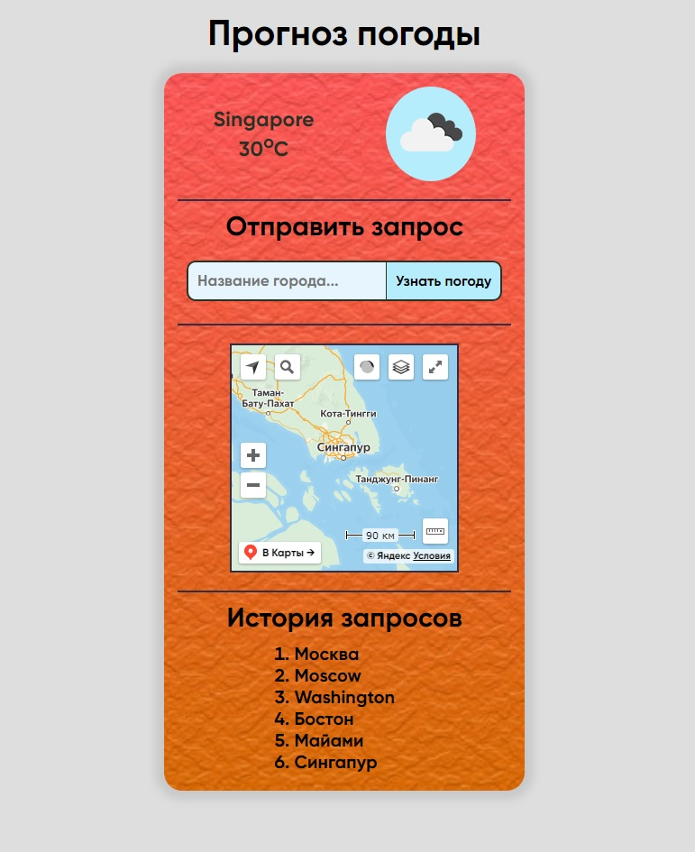
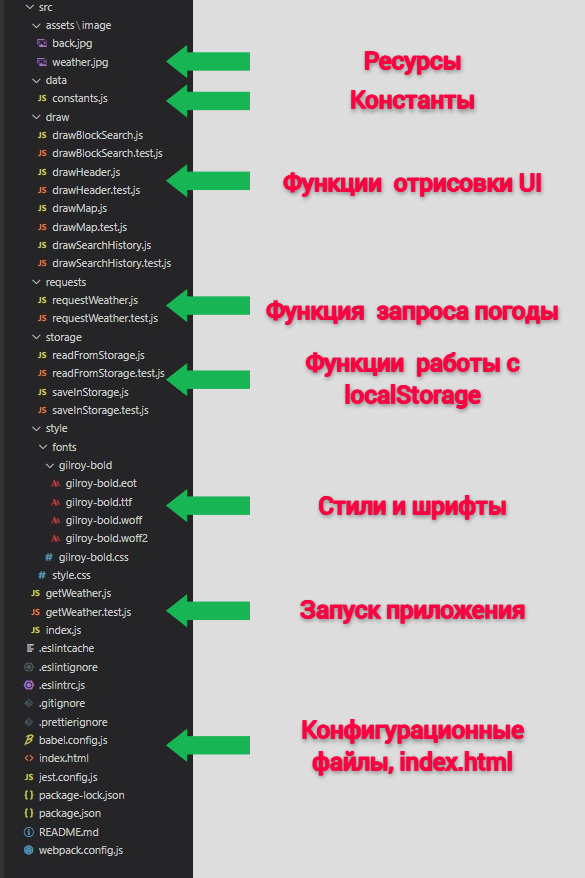

<h1 align="center">Прогноз Погоды</h1>

_**[Развёрнуто здесь](https://djess-v.github.io/otus--homework--07/)**_

---

<h2>Визуальное представление</h2>

<h2>Описание приложения</h2>

1. При открытии страницы вы увидите прогноз погоды в своем городе.

2. В поле для ввода вы можете ввести название города, нажав кнопку "Узнать погоду" приложение отправит запрос для получения данных о погоде, в выбранном вами городе, и отобразит её. Также будет отображена карта, с помощью сервиса Яндекс.Карты, которая будет отображать тот город, который вы ввели в поле ввода. Если введённые данные в поле ввода будут не соответствовать критериям поиска, то под полем ввода появиться соответствующее сообщение.

3. Введенные вами города сохраняются у вас в браузере, так что вы сможете видеть последние 10 городов, которые вы вводили в поле ввода (записи в истории не повторяются).

4. При клике по названию города в списке истории вы увидите погоду в выбранном городе.

<h2>Структура проекта</h2>

